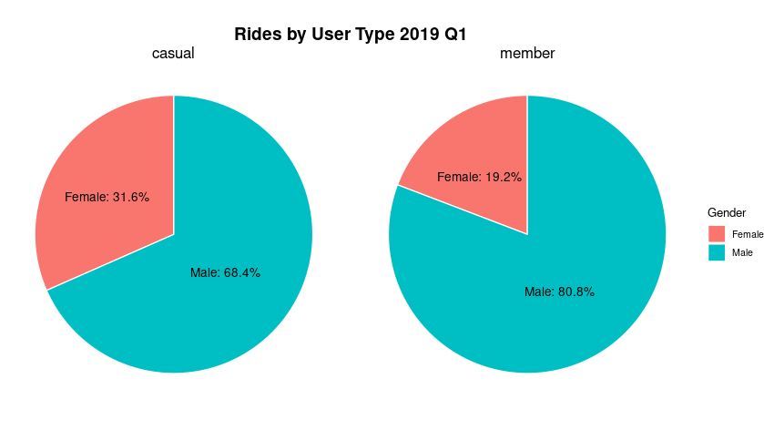
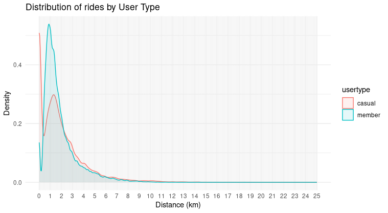
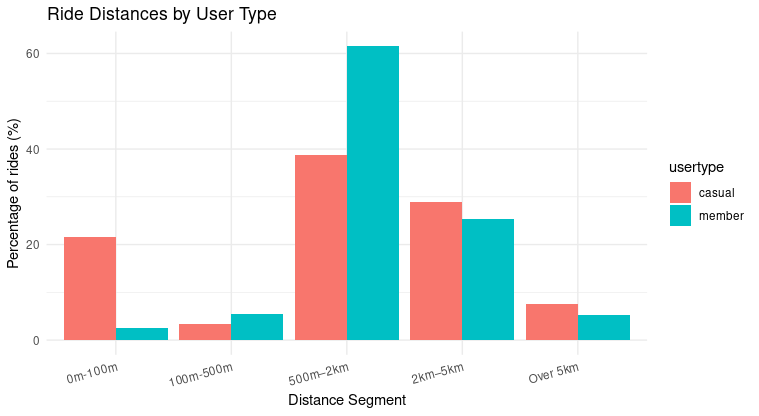

## 1. Introduction
### 1.1 Background
This analysis is part of final Capstone project of Courseras "Google Data Analytics Course'. The current analysis involves analyzing Divvy_Trips data sets from 2019,2020 Q1. 

### 1.2 Business Task
Business task is to find the differences between regular users and app subscribers for bike renting for the purpose of creating a marketing strategy targeting regular non-subscribers.  

## 2. Setup

### 2.1 Load Libraries
```{r load libraries, eval=FALSE}
library(pillar)
library(tidyverse)
library(dplyr)
library(geosphere)
library(gt)
library(leaflet)
library(ggplot2)
library(maps)
library(ggmap)
library(osmdata)
library(sf)
library(leafsync)
```

### 2.2 Import Data
```{r Import Data, eval=FALSE}
library(readxl)

trips_2019 <- read_csv("/cloud/project/Divvy_Trips_2019_Q1 - Divvy_Trips_2019_Q1.csv")

trips_2020 <- read_csv("/cloud/project/Divvy_Trips_2020_Q1 - Divvy_Trips_2020_Q1.csv")
```

## 3. Data preperation 

### 3.1 Cleaning
```{r Cleaning, eval=FALSE}
trips_2019_clean <- trips_2019 %>%
  transmute(
    trip_id=as.character(trip_id),
    started_at = as.POSIXct(start_time, format = "%Y-%m-%d %H:%M:%S"),
    ended_at = as.POSIXct(end_time, format = "%Y-%m-%d %H:%M:%S"),
    from_station_id=from_station_id,
    to_station_id=to_station_id,
    from_station_name=from_station_name,
    to_station_name=to_station_name,
    usertype = ifelse(usertype == "Subscriber", "member", "casual"),
    gender = gender,
    birthyear = birthyear,
    start_lat=NA_real_,
    start_lng=NA_real_,
    end_lat=NA_real_,
    end_lng=NA_real_,
    distance_m = distHaversine(
    cbind(start_lng, start_lat),
    cbind(end_lng, end_lat)),
    distance_km = (distance_m / 1000)
  )

trips_2020_clean <- trips_2020 %>% 
  transmute(
    trip_id=as.character(ride_id),
    started_at = as.POSIXct(started_at, format = "%Y-%m-%d %H:%M:%S"),
    ended_at = as.POSIXct(ended_at, format = "%Y-%m-%d %H:%M:%S"),
    from_station_id=start_station_id,
    to_station_id=end_station_id,
    from_station_name=start_station_name,
    to_station_name=end_station_name,
    usertype = member_casual,
    gender = NA_character_,
    birthyear = NA_real_,
    start_lat=start_lat,
    start_lng=start_lng,
    end_lat=end_lat,
    end_lng=end_lng,
    distance_m = distHaversine( #extracted from geo coordinates 
    cbind(start_lng, start_lat),
    cbind(end_lng, end_lat)),
    distance_km = (distance_m / 1000)
)
```

### 3.2 Merging
```{r Mergin, eval=FALSE}
#combine in a single data set
dt_combined <- bind_rows(trips_2020_clean, trips_2019_clean)
```

```r
#remove old datasets
rm(trips_2019,trips_2019_clean,trips_2020,trips_2020_clean)
```

## 4. Exploratory Data Analysis (EDA)

### 4.1 Total Rides Summary
```{r EDA, eval=FALSE}
dt_combined%>%
  group_by(usertype) %>%
  summarise(
    total_rides = n()
  ) %>%
  mutate(
    percent = round(100 * total_rides / sum(total_rides), 2)
  )
```
Result:

| Usertype | Total Rides | Percent (%) |
|----------|-------------|-------------|
| Casual   | 71,643      | 9.05        |
| Member   | 720,313     | 90.95       |


### 4.2 Gender Analysis
```{r Gender, eval=FALSE}
dt_gender <- dt_combined %>%
  transmute(
    gender = gender,
    usertype = usertype
  )

#gender by usertype
gender_by_user <- dt_gender %>%
  filter(!is.na(gender), !is.na(usertype)) %>%
  group_by(usertype, gender) %>%
  summarise(count = n(), .groups = "drop") %>%
  group_by(usertype) %>%
  mutate(percent = round(100 * count / sum(count), 1))

ggplot(gender_by_user, aes(x = "", y = percent, fill = gender)) +
  geom_bar(stat = "identity", width = 1, color = "white") +
  coord_polar("y") +
  facet_wrap(~ usertype) +
  labs(
    title = "Rides by User Type 2019 Q1",
    fill = "Gender"
  ) +
  theme_void() +
  theme(
    plot.title = element_text(hjust = 0.5, size = 16, face = "bold"),
    strip.text = element_text(size = 14)  
  ) +
  geom_text(
    aes(label = paste0(gender, ": ", percent, "%")),
    position = position_stack(vjust = 0.5),
    size = 4,
    hjust = 0.6
  )

rm(dt_gender_age,gender_by_user)
```


- **Most rides** are taken by **men**.
- **Women ride more frequently** as **casual users** than as members.

### 4.4 Distance Analysis
```{r Distance, eval=FALSE}
dt_distance <- dt_combined %>%
  transmute(
    usertype = usertype,
    distance_km = (distance_m / 1000)
  )

#distance density distribution - critical behaviour distinction found 
ggplot(dt_distance, aes(x = distance_km, color = usertype, fill = usertype)) +
  geom_density(alpha = 0.1) +
  scale_x_continuous(
    limits = c(0, 25),
    breaks = seq(0, 25, by = 1)
  ) +
  labs(
    title = "Distribution of rides by User Type",
    x = "Distance (km)",
    y = "Density"
  ) +
  theme_minimal() +
  theme(
    panel.grid.minor = element_line(color = "gray90")
  )
```


- From density function we see that there is a huge difference for user types under 500m distance.
- Based on this a more detailed analysis is done on distance.

```{r Distance 2, eval=FALSE}
dt_distance <- dt_combined %>%
  transmute(
    usertype = usertype,
    distance_km = (distance_m / 1000)
  )

dt_binned <- dt_distance %>%
  filter(!is.na(distance_km)) %>%
  mutate(
    distance_group = case_when(
      distance_km >= 0 & distance_km < 0.1 ~ "0m-100m",
      distance_km >=0.1 & distance_km <0.5 ~ "100m-500m",
      distance_km >= 0.5 & distance_km < 2 ~ "500m–2km",
      distance_km >= 2 & distance_km < 5 ~ "2km–5km",
      distance_km >= 5 ~ "Over 5km"
    ),
    distance_group = factor(distance_group, levels = c("0m-100m","100m-500m", "500m–2km", "2km–5km", "Over 5km"))
  )

#distance summary
distance_summary <- dt_binned %>%
  group_by(usertype, distance_group) %>%
  summarise(count = n(), .groups = "drop") %>%
  group_by(usertype) %>%
  mutate(percent = round(100 * count / sum(count), 2))

#distance segments
ggplot(distance_summary, aes(x = distance_group, y = percent, fill = usertype)) +
  geom_bar(stat = "identity", position = "dodge") +
  labs(
    title = "Ride Distances by User Type",
    x = "Distance Segment",
    y = "Percentage of rides (%)"
  ) +
  theme_minimal() +
  scale_fill_manual(values = c("casual" = "#F8766D", "member" = "#00BFC4")) +
  theme(axis.text.x = element_text(angle = 15, hjust = 1))
```


- Casual riders are much more likely to travel short distances (under 500m) compared to member
- Members are more likely to rent for medium distances (500m - 2km)

---

## 5. Limitations

### 5.1 Age 
```{r Age, eval=FALSE}
dt_age <- dt_combined %>%
  transmute(
    age = 2025-birthyear,
    usertype = usertype
  )

#max age of rider
max(dt_age$age, na.rm = TRUE)
```

Max age is 125 - impossible. Potential problems with this data set therefore no further age analysis.

### 5.2 Trip duration and distance
```{r Duration, eval=FALSE}
dt_duration <-dt_combined %>%
  transmute(
    duration=ended_at-started_at
  )

min(dt_duration$duration, na.rm = TRUE)
```

We see negative trip duration!!! There are also several trips 0 seconds and incredibly short distances. They were not taken out of the analysis as they still show insights that perhaps several of the users would rent the bike, but immediately decide to change their mind. As this is a large category of users, it could be valuable to think how a marketing strategy would encourage people not to change their mind when renting the bike or perhaps its bad data.

---

## 6. Conclusions

The analysis shows clear behavioral differences between members and casual users.

### App activity and distance differences
- Members tend to ride more frequently on weekdays and over medium distances (0.5–2km), likely for commuting purposes. 
- In contrast, casual users prefer to weekends and favor short distances, suggesting leisure or spontaneous use.

### Gender-based differences
Men are dominant across all segments, but casual usage has a relatively higher female share than member usage, which may reflect different marketing or accessibility needs.

### Limitations
A significant portion of rides under 500m and/or of extremely short duration raises questions about either user hesitation or data integrity. This segment deserves attention, as converting short/incomplete rides into full ones could be a growth opportunity.

---

## 7. Recommendations

- Since members ride medium distances mostly during the week, target casual users during weekends with subscription incentives that would promote having longer trips 
- Marketing strategy should consider women inclusive campaigns 
- For future analysis, improved data quality control should be put in place
